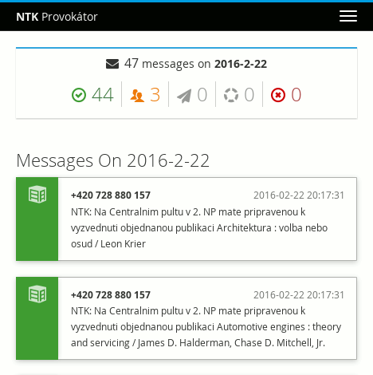

# Provokátor

An audit tool for `smstools-http-api`.

Replicates new messages from the `smstools-http-api` to a local [PostgreSQL][] database for long-term archival. Also allows operators to send ad-hoc short messages for testing and other purposes.

## Installation

Since Provokátor runs on [Python 3][], the dependencies are currently somewhat unstable. Most notably, [Twisted][] WSGI support was only recently ported and thus a very fresh release (newer than 15.5.0) is required.

If such a release is available, all dependencies can be fetched automatically with:

    pip3 install -r requirements.txt

In case you need to install newer Twisted:

    pip3 install -e 'git+https://github.com/twisted/twisted.git@trunk#egg=twisted'

You might want to consider creating a sandbox (so-called [virtualenv][]) to hold these dependencies so that you do not clobber your system packages.

## Database

You need to initialize your database with the `db.sql` script. It contains a single table called `message` plus several views on top of that table. After creating the login role and the database as usual:

    CREATE ROLE sms ENCRYPTED PASSWORD 'smspass' LOGIN;
    CREATE DATABASE sms OWNER sms;
    \c sms
    ALTER SCHEMA public OWNER TO sms;

You should just read the file in:

    psql -U sms sms <db.sql

And that's it.

## Running

Create a configuration file based on the included `config/provokator.ini` and start the application with:

    ./provokator-daemon -c config/provokator.ini

If you feel like it, create an [unit file][] to start the application automatically.

## Authentication

The application does not perform any kind of authentication. You need to ensure that it receives a single HTTP header called `X-Roles` that includes roles of the current user. These roles are mapped to privileges using the rules in the `acl` section of the configuration file. Individual roles are extracted from the `X-Roles` header using the `\w+` regular expression. Valid formats include `omnipotent dictator` or `sysadmin;director`.

There are two privilege levels:

- `user` can perform read-only operations, including viewing the messages.
- `admin` can send arbitrary messages to arbitrary phone numbers.

There are several ways to get this header set, but you are probably going to use [httpd][] and either manipulate the headers directly or use [Shibboleth SSO][].

[PostgreSQL]: http://www.postgresql.org/
[Python 3]: https://en.wikipedia.org/wiki/History_of_Python#Version_3.0
[Twisted]: https://twistedmatrix.com/trac/
[virtualenv]: http://docs.python-guide.org/en/latest/dev/virtualenvs/
[unit file]: https://access.redhat.com/documentation/en-US/Red_Hat_Enterprise_Linux/7/html/System_Administrators_Guide/sect-Managing_Services_with_systemd-Unit_Files.html
[httpd]: https://httpd.apache.org/docs/2.4/
[Shibboleth SSO]: https://shibboleth.net/
